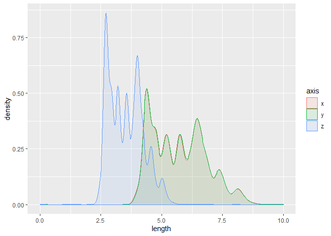
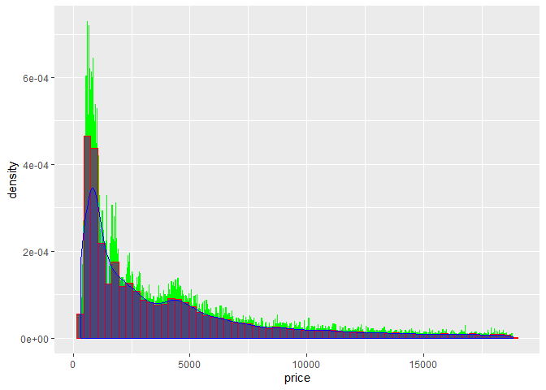

## SETUP


FXN: Save graphical outputs

```r
picsave <- function(graph, name) {
  ggsave(plot = graph, filename= name, device = "pdf", width = 12, height = 8, path = "~/GitHub/S_Lipkind_Rundergrad2020/week4/pics/")
}
```
---
## CHAPTER 7 PROBLEMS

### 7.3.4

#### 1. Explore the distribution of each of the x, y, and z variables in diamonds. What do you learn? Think about a diamond and how you might decide which dimension is the length, width, and depth.

```r
glimpse(diamonds)
```

```
## Observations: 53,940
## Variables: 10
## $ carat   <dbl> 0.23, 0.21, 0.23, 0.29, 0.31, 0.24, 0.24, 0.26, 0.22, 0.23,...
## $ cut     <ord> Ideal, Premium, Good, Premium, Good, Very Good, Very Good, ...
## $ color   <ord> E, E, E, I, J, J, I, H, E, H, J, J, F, J, E, E, I, J, J, J,...
## $ clarity <ord> SI2, SI1, VS1, VS2, SI2, VVS2, VVS1, SI1, VS2, VS1, SI1, VS...
## $ depth   <dbl> 61.5, 59.8, 56.9, 62.4, 63.3, 62.8, 62.3, 61.9, 65.1, 59.4,...
## $ table   <dbl> 55, 61, 65, 58, 58, 57, 57, 55, 61, 61, 55, 56, 61, 54, 62,...
## $ price   <int> 326, 326, 327, 334, 335, 336, 336, 337, 337, 338, 339, 340,...
## $ x       <dbl> 3.95, 3.89, 4.05, 4.20, 4.34, 3.94, 3.95, 4.07, 3.87, 4.00,...
## $ y       <dbl> 3.98, 3.84, 4.07, 4.23, 4.35, 3.96, 3.98, 4.11, 3.78, 4.05,...
## $ z       <dbl> 2.43, 2.31, 2.31, 2.63, 2.75, 2.48, 2.47, 2.53, 2.49, 2.39,...
```

```r
#(xyz) are continuous variables, measuring the dimensions of each diamond
#Want to see distributions of each axis, but hmm, the three axes are not united by anything that I can easily call in ggplot in one go
#Solution: gathering to create "axis" and "length"

diamonds %>% gather(axis, length, c(x,y,z)) %>%
  ggplot(aes(x = length, fill = axis, color = axis)) +
  geom_density(alpha = .1) +
  xlim(0,10)
```

```
## Warning: Removed 11 rows containing non-finite values (stat_density).
```

<!-- -->

```r
#x and y axes have nearly complete overlap, while z is smaller. Is z depth?
```


#### 2. Explore the distribution of price. Do you discover anything unusual or surprising? (Hint: Carefully think about the binwidth and make sure you try a wide range of values.)

```r
glimpse(diamonds)
```

```
## Observations: 53,940
## Variables: 10
## $ carat   <dbl> 0.23, 0.21, 0.23, 0.29, 0.31, 0.24, 0.24, 0.26, 0.22, 0.23,...
## $ cut     <ord> Ideal, Premium, Good, Premium, Good, Very Good, Very Good, ...
## $ color   <ord> E, E, E, I, J, J, I, H, E, H, J, J, F, J, E, E, I, J, J, J,...
## $ clarity <ord> SI2, SI1, VS1, VS2, SI2, VVS2, VVS1, SI1, VS2, VS1, SI1, VS...
## $ depth   <dbl> 61.5, 59.8, 56.9, 62.4, 63.3, 62.8, 62.3, 61.9, 65.1, 59.4,...
## $ table   <dbl> 55, 61, 65, 58, 58, 57, 57, 55, 61, 61, 55, 56, 61, 54, 62,...
## $ price   <int> 326, 326, 327, 334, 335, 336, 336, 337, 337, 338, 339, 340,...
## $ x       <dbl> 3.95, 3.89, 4.05, 4.20, 4.34, 3.94, 3.95, 4.07, 3.87, 4.00,...
## $ y       <dbl> 3.98, 3.84, 4.07, 4.23, 4.35, 3.96, 3.98, 4.11, 3.78, 4.05,...
## $ z       <dbl> 2.43, 2.31, 2.31, 2.63, 2.75, 2.48, 2.47, 2.53, 2.49, 2.39,...
```

```r
(b10 <- diamonds %>% ggplot(aes(
  x = price)) +
  geom_histogram(binwidth = 10))
```

<!-- -->

```r
#Appears to be a small gap in rows that have a price ~$1000

(psmallb10 <- diamonds %>% filter(price < 5000) %>%
  ggplot(aes(x = price)) +
  geom_histogram(binwidth = 10))
```

<!-- -->

```r
#More accurately, the gap is around $1500

(plargeb10 <- diamonds %>% filter(price > 5000) %>%
  ggplot(aes(x = price)) +
  geom_histogram(binwidth = 10))
```

<!-- -->

```r
#seems pretty standard, makes sense to have lower counts overall
```


```r
#for funsies, comparing binwidth 10 to a density plot, which doesn't use bins at all
diamonds %>% ggplot(aes(
  x = price)) +
  geom_histogram(aes(y = ..density..), binwidth = 10, position = "identity", color = "green") +
  geom_histogram(aes(y = ..density..), binwidth = 300, position = "identity", color = "red") +
  geom_density(fill = "blue", alpha = .2, color = "blue")
```

<!-- -->

```r
#The density plot itself acts like a smoothened histogram plot, generalizing the peaks and valleys seen in binwidth = 10 (green)
#Not sure why the density plot underestimates the beginning peak so much
# I'm sorry this looks so ugly.
```

#### 3. How many diamonds are 0.99 carat? How many are 1 carat? What do you think is the cause of the difference?

```r
diamonds %>% count(carat == .99) #23
```

```
## # A tibble: 2 x 2
##   `carat == 0.99`     n
##   <lgl>           <int>
## 1 FALSE           53917
## 2 TRUE               23
```

```r
diamonds %>% count(carat == 1.0) #1558
```

```
## # A tibble: 2 x 2
##   `carat == 1`     n
##   <lgl>        <int>
## 1 FALSE        52382
## 2 TRUE          1558
```

```r
#Hypothesis: it is likely that human measurers were likely to round to the nearest integer, rather than specifying .99.
```


#### 4. Compare and contrast coord_cartesian() vs xlim() or ylim() when zooming in on a histogram. What happens if you leave binwidth unset? What happens if you try and zoom so only half a bar shows?

```r
a <- diamonds %>% ggplot(aes(
  x = price)) +
  geom_histogram(binwidth = 10) +
  coord_cartesian(xlim = c(0,2000), ylim = c(0, 320))

b <- diamonds %>% ggplot(aes(
  x = price)) +
  geom_histogram(binwidth = 10) +
  xlim(0,2000) +
  ylim(0,320) #xlim and ylim removed far more values

c <- diamonds %>% ggplot(aes(
  x = price)) +
  geom_histogram() +
  coord_cartesian(xlim = c(0,2000), ylim = c(0, 320)) #defaults to binwidth = 30
 
d <- diamonds %>% ggplot(aes(
  x = price)) +
  geom_histogram(binwidth = 200) +
  coord_cartesian(xlim = c(0,100)) #nothing shows up when the range is smaller than the size of the bin

a
```

<!-- -->

```r
b
```

```
## Warning: Removed 29733 rows containing non-finite values (stat_bin).
```

```
## Warning: Removed 10 rows containing missing values (geom_bar).
```

<!-- -->

```r
c
```

```
## `stat_bin()` using `bins = 30`. Pick better value with `binwidth`.
```

<!-- -->

```r
d
```

<!-- -->

### 7.4.1

#### 1. What happens to missing values in a histogram? What happens to missing values in a bar chart? Why is there a difference?


```r
flights %>% ggplot(aes(x = dep_time)) + geom_histogram()
```

```
## `stat_bin()` using `bins = 30`. Pick better value with `binwidth`.
```

```
## Warning: Removed 8255 rows containing non-finite values (stat_bin).
```

<!-- -->

```r
summary(flights$dep_time) #8255 NA
```

```
##    Min. 1st Qu.  Median    Mean 3rd Qu.    Max.    NA's 
##       1     907    1401    1349    1744    2400    8255
```
*If na.rm = FALSE, histograms will not include NA values, instead giving a warning stating, "Removed 8255 rows containing non-finite values (stat_bin)."*

```r
glimpse(flights$origin)
```

```
##  chr [1:336776] "EWR" "LGA" "JFK" "JFK" "LGA" "EWR" "EWR" "LGA" "JFK" "LGA" ...
```

```r
na_flights <- gsub("EWR", NA, flights$origin) #replace one value of origin with NA

flights <- mutate(flights, origin = NULL, na_origin = na_flights)

flights %>% ggplot(aes(x = na_origin)) + geom_bar()
```

<!-- -->
*Bar charts include NA in the chart.*  
*This makes sense, because bar charts quantify categorical variables, whereas histograms quantify continuous variables. Histograms have no way of including a non_continuous value, but bar charts do.*

#### 2. What does na.rm = TRUE do in mean() and sum()?

```r
mean(flights$dep_time, na.rm = TRUE) #12.63907
```

```
## [1] 1349.11
```

```r
mean(flights$dep_time) #NA
```

```
## [1] NA
```

```r
sum(flights$dep_time, na.rm = TRUE) #443210949
```

```
## [1] 443210949
```

```r
sum(flights$dep_time) #NA
```

```
## [1] NA
```
*Because dep_time includes NA values which are included when na.rm = FALSE, any resulting calculation is necessarily NA. Using na.rm = TRUE removes NA values, leaving behind only continuous data.*

### 7.5.1.1

#### 1. Use what you’ve learned to improve the visualisation of the departure times of cancelled vs. non-cancelled flights.

```r
#so, comparing schedule departure times b/w cancelled/not cancelled, since cancelled flights
#never departed
#need to gather sched_dep_time for all rows where dep_time = NA, and compare to sched_dep_time for non-cancelled flights
#use boxplot, coord_flip()

glimpse(flights)
```

```
## Observations: 336,776
## Variables: 19
## $ year           <int> 2013, 2013, 2013, 2013, 2013, 2013, 2013, 2013, 2013...
## $ month          <int> 1, 1, 1, 1, 1, 1, 1, 1, 1, 1, 1, 1, 1, 1, 1, 1, 1, 1...
## $ day            <int> 1, 1, 1, 1, 1, 1, 1, 1, 1, 1, 1, 1, 1, 1, 1, 1, 1, 1...
## $ dep_time       <int> 517, 533, 542, 544, 554, 554, 555, 557, 557, 558, 55...
## $ sched_dep_time <int> 515, 529, 540, 545, 600, 558, 600, 600, 600, 600, 60...
## $ dep_delay      <dbl> 2, 4, 2, -1, -6, -4, -5, -3, -3, -2, -2, -2, -2, -2,...
## $ arr_time       <int> 830, 850, 923, 1004, 812, 740, 913, 709, 838, 753, 8...
## $ sched_arr_time <int> 819, 830, 850, 1022, 837, 728, 854, 723, 846, 745, 8...
## $ arr_delay      <dbl> 11, 20, 33, -18, -25, 12, 19, -14, -8, 8, -2, -3, 7,...
## $ carrier        <chr> "UA", "UA", "AA", "B6", "DL", "UA", "B6", "EV", "B6"...
## $ flight         <int> 1545, 1714, 1141, 725, 461, 1696, 507, 5708, 79, 301...
## $ tailnum        <chr> "N14228", "N24211", "N619AA", "N804JB", "N668DN", "N...
## $ dest           <chr> "IAH", "IAH", "MIA", "BQN", "ATL", "ORD", "FLL", "IA...
## $ air_time       <dbl> 227, 227, 160, 183, 116, 150, 158, 53, 140, 138, 149...
## $ distance       <dbl> 1400, 1416, 1089, 1576, 762, 719, 1065, 229, 944, 73...
## $ hour           <dbl> 5, 5, 5, 5, 6, 5, 6, 6, 6, 6, 6, 6, 6, 6, 6, 5, 6, 6...
## $ minute         <dbl> 15, 29, 40, 45, 0, 58, 0, 0, 0, 0, 0, 0, 0, 0, 0, 59...
## $ time_hour      <dttm> 2013-01-01 05:00:00, 2013-01-01 05:00:00, 2013-01-0...
## $ na_origin      <chr> NA, "LGA", "JFK", "JFK", "LGA", NA, NA, "LGA", "JFK"...
```

```r
summary(flights)
```

```
##       year          month             day           dep_time    sched_dep_time
##  Min.   :2013   Min.   : 1.000   Min.   : 1.00   Min.   :   1   Min.   : 106  
##  1st Qu.:2013   1st Qu.: 4.000   1st Qu.: 8.00   1st Qu.: 907   1st Qu.: 906  
##  Median :2013   Median : 7.000   Median :16.00   Median :1401   Median :1359  
##  Mean   :2013   Mean   : 6.549   Mean   :15.71   Mean   :1349   Mean   :1344  
##  3rd Qu.:2013   3rd Qu.:10.000   3rd Qu.:23.00   3rd Qu.:1744   3rd Qu.:1729  
##  Max.   :2013   Max.   :12.000   Max.   :31.00   Max.   :2400   Max.   :2359  
##                                                  NA's   :8255                 
##    dep_delay          arr_time    sched_arr_time   arr_delay       
##  Min.   : -43.00   Min.   :   1   Min.   :   1   Min.   : -86.000  
##  1st Qu.:  -5.00   1st Qu.:1104   1st Qu.:1124   1st Qu.: -17.000  
##  Median :  -2.00   Median :1535   Median :1556   Median :  -5.000  
##  Mean   :  12.64   Mean   :1502   Mean   :1536   Mean   :   6.895  
##  3rd Qu.:  11.00   3rd Qu.:1940   3rd Qu.:1945   3rd Qu.:  14.000  
##  Max.   :1301.00   Max.   :2400   Max.   :2359   Max.   :1272.000  
##  NA's   :8255      NA's   :8713                  NA's   :9430      
##    carrier              flight       tailnum              dest          
##  Length:336776      Min.   :   1   Length:336776      Length:336776     
##  Class :character   1st Qu.: 553   Class :character   Class :character  
##  Mode  :character   Median :1496   Mode  :character   Mode  :character  
##                     Mean   :1972                                        
##                     3rd Qu.:3465                                        
##                     Max.   :8500                                        
##                                                                         
##     air_time        distance         hour           minute     
##  Min.   : 20.0   Min.   :  17   Min.   : 1.00   Min.   : 0.00  
##  1st Qu.: 82.0   1st Qu.: 502   1st Qu.: 9.00   1st Qu.: 8.00  
##  Median :129.0   Median : 872   Median :13.00   Median :29.00  
##  Mean   :150.7   Mean   :1040   Mean   :13.18   Mean   :26.23  
##  3rd Qu.:192.0   3rd Qu.:1389   3rd Qu.:17.00   3rd Qu.:44.00  
##  Max.   :695.0   Max.   :4983   Max.   :23.00   Max.   :59.00  
##  NA's   :9430                                                  
##    time_hour                    na_origin        
##  Min.   :2013-01-01 05:00:00   Length:336776     
##  1st Qu.:2013-04-04 13:00:00   Class :character  
##  Median :2013-07-03 10:00:00   Mode  :character  
##  Mean   :2013-07-03 05:22:54                     
##  3rd Qu.:2013-10-01 07:00:00                     
##  Max.   :2013-12-31 23:00:00                     
## 
```

```r
#cancelled_flights <- filter(flights, is.na(flights$dep_time))
#not_cancelled_flights <- filter(flights, !is.na(flights$dep_time))

flights %>% ggplot(aes(x = is.na(dep_time), y = sched_dep_time, na.rm = FALSE)) +
  geom_boxplot(position = "dodge") +
  ggtitle("Scheduled departure time in non-cancelled and cancelled flights")
```

<!-- -->

#### 2. What variable in the diamonds dataset is most important for predicting the price of a diamond? How is that variable correlated with cut? Why does the combination of those two relationships lead to lower quality diamonds being more expensive?

```r
glimpse(diamonds)
```

```
## Observations: 53,940
## Variables: 10
## $ carat   <dbl> 0.23, 0.21, 0.23, 0.29, 0.31, 0.24, 0.24, 0.26, 0.22, 0.23,...
## $ cut     <ord> Ideal, Premium, Good, Premium, Good, Very Good, Very Good, ...
## $ color   <ord> E, E, E, I, J, J, I, H, E, H, J, J, F, J, E, E, I, J, J, J,...
## $ clarity <ord> SI2, SI1, VS1, VS2, SI2, VVS2, VVS1, SI1, VS2, VS1, SI1, VS...
## $ depth   <dbl> 61.5, 59.8, 56.9, 62.4, 63.3, 62.8, 62.3, 61.9, 65.1, 59.4,...
## $ table   <dbl> 55, 61, 65, 58, 58, 57, 57, 55, 61, 61, 55, 56, 61, 54, 62,...
## $ price   <int> 326, 326, 327, 334, 335, 336, 336, 337, 337, 338, 339, 340,...
## $ x       <dbl> 3.95, 3.89, 4.05, 4.20, 4.34, 3.94, 3.95, 4.07, 3.87, 4.00,...
## $ y       <dbl> 3.98, 3.84, 4.07, 4.23, 4.35, 3.96, 3.98, 4.11, 3.78, 4.05,...
## $ z       <dbl> 2.43, 2.31, 2.31, 2.63, 2.75, 2.48, 2.47, 2.53, 2.49, 2.39,...
```

```r
#variables to consider: carat, color, clarity, table
#which variables predict price the best?

lm(data = diamonds, price ~ carat + color + clarity + table + cut) %>% summary(.)
```

```
## 
## Call:
## lm(formula = price ~ carat + color + clarity + table + cut, data = diamonds)
## 
## Residuals:
##      Min       1Q   Median       3Q      Max 
## -16843.5   -678.7   -198.5    464.3  10357.9 
## 
## Coefficients:
##              Estimate Std. Error  t value Pr(>|t|)    
## (Intercept) -2640.456    157.572  -16.757  < 2e-16 ***
## carat        8893.592     12.078  736.327  < 2e-16 ***
## color.L     -1911.876     17.706 -107.979  < 2e-16 ***
## color.Q      -626.510     16.116  -38.876  < 2e-16 ***
## color.C      -170.999     15.065  -11.351  < 2e-16 ***
## color^4        20.164     13.836    1.457    0.145    
## color^5       -85.778     13.071   -6.563 5.34e-11 ***
## color^6       -49.783     11.884   -4.189 2.80e-05 ***
## clarity.L    4216.374     30.819  136.812  < 2e-16 ***
## clarity.Q   -1833.656     28.816  -63.634  < 2e-16 ***
## clarity.C     923.145     24.669   37.421  < 2e-16 ***
## clarity^4    -362.910     19.731  -18.393  < 2e-16 ***
## clarity^5     216.703     16.103   13.458  < 2e-16 ***
## clarity^6       1.665     14.031    0.119    0.906    
## clarity^7     110.273     12.378    8.909  < 2e-16 ***
## table         -18.541      2.719   -6.818 9.31e-12 ***
## cut.L         664.449     20.945   31.723  < 2e-16 ***
## cut.Q        -344.367     18.070  -19.058  < 2e-16 ***
## cut.C         162.714     15.769   10.319  < 2e-16 ***
## cut^4         -16.386     12.650   -1.295    0.195    
## ---
## Signif. codes:  0 '***' 0.001 '**' 0.01 '*' 0.05 '.' 0.1 ' ' 1
## 
## Residual standard error: 1156 on 53920 degrees of freedom
## Multiple R-squared:  0.916,	Adjusted R-squared:  0.916 
## F-statistic: 3.095e+04 on 19 and 53920 DF,  p-value: < 2.2e-16
```

```r
#wow, that's kind of a mess, but carat seems to have the largest effect

diamonds %>% ggplot(aes(y = carat, x = cut)) +
  geom_boxplot(aes(color = cut)) +
  scale_colour_viridis_d()
```

<!-- -->
*There seems to be an interesting relationship between cut and carat wherein high carats are associated with the worst cuts, and low-mid carats have the best average quality*
*Note: I tried to use geom_point(), but that seemed to obscure things a bit, so I went back to boxplot.*

#### 3. Install the ggstance package, and create a horizontal boxplot. How does this compare to using coord_flip()?

```r
#install.packages("ggstance")
#library(ggstance)
#glimpse(flights)

flights %>% filter( carrier == "UA") %>%
  ggplot(aes(x = dep_time, y = carrier)) +
  ggstance::geom_boxploth()
```

```
## Warning: Removed 686 rows containing non-finite values (stat_boxploth).
```

<!-- -->

```r
flights %>% filter( carrier == "UA") %>%
  ggplot(aes(y = dep_time, x = carrier)) +
  geom_boxplot() +
  coord_flip()
```

```
## Warning: Removed 686 rows containing non-finite values (stat_boxplot).
```

<!-- -->
*They look exactly the same, but I had to switch x and y variables in ggstance to get it to work.*

#### 5. Compare and contrast geom_violin() with a facetted geom_histogram(), or a coloured geom_freqpoly(). What are the pros and cons of each method?

```r
ggplot(data = diamonds, mapping = aes(x = price)) + 
  geom_freqpoly(mapping = aes(colour = cut), binwidth = 500)
```

<!-- -->

```r
ggplot(data = diamonds, mapping = aes(x = price)) + 
  geom_histogram() +
  facet_wrap(vars(cut))
```

```
## `stat_bin()` using `bins = 30`. Pick better value with `binwidth`.
```

<!-- -->

```r
ggplot(data = diamonds, mapping = aes(x = cut, y = price)) + 
  geom_violin()
```

<!-- -->
*freqpoly allows one to directly compare counts b/w different categorical variables, which is handy! However, understanding the relationships may be a bit tricky to parse. Facetting essentially takes freqpoly and separates each category into its own plot, which can be helpful for seeing intra-category distributions. Meanwhile, violin plots do away with counts entirely, and show the distributions of price for each category. One may be able to get an intuitive sense of each category's distribution while comparing each other directly by price.*


#### 6. If you have a small dataset, it’s sometimes useful to use geom_jitter() to see the relationship between a continuous and categorical variable. The ggbeeswarm package provides a number of methods similar to geom_jitter(). List them and briefly describe what each one does.

 * *`position_quasirandom()` melds scatterplots and violin plots to give you a plot that shows the distribution of a categorical variable alongside the points that overlap.  *  
 * *`geom_beeswarm()`, like `geom_jitter()`, introduces a small amount of random variation to produce plots where no points overlap. *  
 * *`geom_quasirandom()`estimates kernel density (i.e. the pattern of point distribution) and uses the von der Corput sequence to distribute points in the plot quasirandomly. *
 * *`method = "pseudorandom"` is a variation of quasirandom that uniformly distributes points after calculating kernel density.*  
 * *`method = "smiley"` and `method = "frowney"` do.. I don't know what, honestly.*  
 * *`method = "tukey"` resembles a barplot in appearance, and uses "constrained permutations of offsets" to distribute points (whatever that means).*  
 
### Last Problem

#### "Describe an *experiment* that would possess 2 *categorical* variables and 2 *continuous* variables."

  *Let us revisit the classic plant music experiment. We shall play different kinds of music over different lengths of time, and observe the effect of growth to the petiole and the stem.*
  * *categorical variables:*  
      * *type of music played to plant*
      * *time*
    *continuous variables:*  
      * *petiole elongation*
      * *stem elongation*
