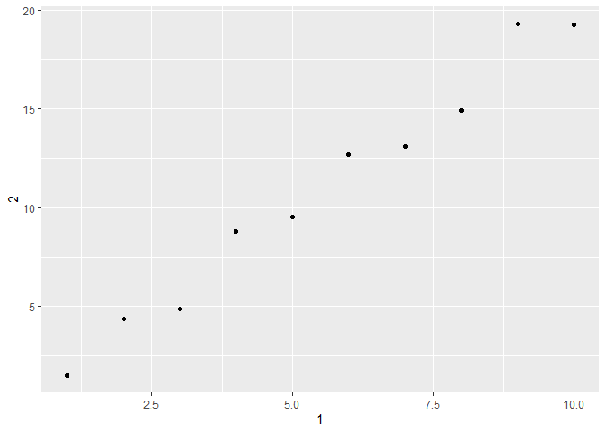

## Chapter 10 Problems

### 10.5

#### 10.5.1: How can you tell if an object is a tibble? (Hint: try printing mtcars, which is a regular data frame).  
*Tibbles are distinguished from data frames in that, when printed, they display the first 10 rows, along with all column names and their associated class. They also do not allow partial matching as data frames do.*  
#### 10.5.2: Compare and contrast the following operations on a data.frame and equivalent tibble. What is different? Why might the default data frame behaviours cause you frustration?

```r
df <- data.frame(abc = 1, xyz = "a")
df$x #this will draw the row associated with xyz, since data.tables do partial matches, does not label class
```

```
## [1] a
## Levels: a
```

```r
a <- df[, "xyz"] #any row associated with the column named "xyz", does not label class
#a gives a result that is a factor
b <- df[, c("abc", "xyz")] #any rows associated with the columns "abc" and "xyz", labels classes
#b gives a result that is a data.frame
```


```r
tibble <- as_tibble(df)
tibble$x #because tibbles not have partial matching, this would not give any result. 
```

```
## Warning: Unknown or uninitialised column: 'x'.
```

```
## NULL
```

```r
#That's a good thing! Tibbles require specificity, which means that you are less likely to have ambiguous or faulty code.
c <- tibble %>% select(xyz)
d <- tibble %>% select(xyz, abc) 
#Furthermore, as you can see when comparing (ab) to (cd), c and d only return other tibbles. This keeps the class of the data consistent, instead of ending up with scattered variables and factors and vectors.
```
## Chapter 10 Problems

#### 10.5.4: Practice referring to non-syntactic names in the following data frame by:  
    

```r
annoying <- tibble(
  `1` = 1:10,
  `2` = `1` * 2 + rnorm(length(`1`))
)
```

    ##### 1. Extracting the variable called 1.  

```r
annoying %>% select(`1`)
```

```
## # A tibble: 10 x 1
##      `1`
##    <int>
##  1     1
##  2     2
##  3     3
##  4     4
##  5     5
##  6     6
##  7     7
##  8     8
##  9     9
## 10    10
```
    
    ##### 2. Plotting a scatterplot of 1 vs 2.  

```r
annoying %>% ggplot(aes(x = `1`, y = `2`)) +
  geom_point()
```

<!-- -->
  
    ##### 3. Creating a new column called 3 which is 2 divided by 1.  

```r
annoying <- annoying %>%
  mutate(`3` = `2` / `1`)
```

    ##### 4. Renaming the columns to one, two and three.  

```r
annoying <- annoying %>%
  transmute(
    one = `1`,
    two = `2`,
    three = `3`
  )
```
    
    
#### 10.5.5: What does tibble::enframe() do? When might you use it?

```r
enframe(1:3) #unnamed vector should have name column (1,2,3), and then has a value column that is identical
```

```
## # A tibble: 3 x 2
##    name value
##   <int> <int>
## 1     1     1
## 2     2     2
## 3     3     3
```

```r
enframe(c(a = 5, b = 7)) #named vector? should have (a,b) in name column, and (5,7) in the next column
```

```
## # A tibble: 2 x 2
##   name  value
##   <chr> <dbl>
## 1 a         5
## 2 b         7
```

```r
enframe(list(one = 1, two = 2:3, three = 4:6)) #list should have 1 col with (one, two, three), and the value column is a nested tibble that contains whatever values have been listed.
```

```
## # A tibble: 3 x 2
##   name  value    
##   <chr> <list>   
## 1 one   <dbl [1]>
## 2 two   <int [2]>
## 3 three <int [3]>
```

```r
#Conclusion: If someone had a vector that they wanted to convert into a tibble for easier viewing, enframe() could be useful. Not sure about why the nested tibble property exists.
```

---

## Chapter 11 Problems

### 11.2.2

#### 11.2.2.1: What function would you use to read a file where fields were separated with
“|”?  
*`read_delim(delim = "|")`*

#### 11.2.2.4: Sometimes strings in a CSV file contain commas. To prevent them from causing problems they need to be surrounded by a quoting character, like " or '. By default, read_csv() assumes that the quoting character will be ". What argument to read_csv() do you need to specify to read the following text into a data frame?

```r
read_csv("x,y\n1,'a,b'", quote = "'") #apostraphe
```

```
## # A tibble: 1 x 2
##       x y    
##   <dbl> <chr>
## 1     1 a,b
```


#### 11.2.2.5: Identify what is wrong with each of the following inline CSV files. What happens when you run the code?

```r
read_csv("a,b\n1,2,3\n4,5,6") #2 column names are given, but there are 3 columns' worth of data here
```

```
## Warning: 2 parsing failures.
## row col  expected    actual         file
##   1  -- 2 columns 3 columns literal data
##   2  -- 2 columns 3 columns literal data
```

```
## # A tibble: 2 x 2
##       a     b
##   <dbl> <dbl>
## 1     1     2
## 2     4     5
```

```r
read_csv("a,b,c\n1,2\n1,2,3,4") #3 col_names given here, but row 1 has 2 values (so c has NA), and row 2 has 4 values (so the last one gets dropped)
```

```
## Warning: 2 parsing failures.
## row col  expected    actual         file
##   1  -- 3 columns 2 columns literal data
##   2  -- 3 columns 4 columns literal data
```

```
## # A tibble: 2 x 3
##       a     b     c
##   <dbl> <dbl> <dbl>
## 1     1     2    NA
## 2     1     2     3
```

```r
read_csv("a,b\n\"1") #2 colnames given, only one value given
```

```
## Warning: 2 parsing failures.
## row col                     expected    actual         file
##   1  a  closing quote at end of file           literal data
##   1  -- 2 columns                    1 columns literal data
```

```
## # A tibble: 1 x 2
##       a b    
##   <dbl> <chr>
## 1     1 <NA>
```

```r
read_csv("a,b\n1,2\na,b") #the colnames appear to be repeated in the second row of the tibble
```

```
## # A tibble: 2 x 2
##   a     b    
##   <chr> <chr>
## 1 1     2    
## 2 a     b
```

```r
read_csv("a;b\n1;3") #this data is separated by semicolons, so you should use read_csv2()
```

```
## # A tibble: 1 x 1
##   `a;b`
##   <chr>
## 1 1;3
```


### 11.3.5  

#### 11.3.5.1: What are the most important arguments to locale()?
*`decimal_mark` and `grouping_mark` are important for non-date numbers that deviate from the style used in the US.*
*`encoding` is critical with older strings that are encoded with a system other than UTF-8.*
*`date_names` should be used when working with date-times that have non-English month names.*

#### 11.3.5.2: What happens if you try and set decimal_mark and grouping_mark to the same character? What happens to the default value of grouping_mark when you set decimal_mark to “,”? What happens to the default value of decimal_mark when you set the grouping_mark to “.”?

```r
#parse_number("123.456.789", locale = locale(grouping_mark = ".", decimal_mark = "."))
#Result: error given
#
parse_number("123.456.789", locale = locale(decimal_mark = ","))
```

```
## [1] 123456789
```

```r
#Result: R infers that if "," is being used as a decimal mark, then "." is used as a grouping_mark. Sorry, Switzerland.

parse_number("123.456.789", locale = locale(grouping_mark = "."))
```

```
## [1] 123456789
```

```r
#Result: R infers that "," is the decimal mark. 
```


#### 11.3.5.3: I didn’t discuss the date_format and time_format options to locale(). What do they do? Construct an example that shows when they might be useful.
*`date_format` and `time_format` are useful for when you data doesn't follow the default date or time formats; you can customize how R interprets each value so they parse correctly.*
*e.g. default date-time format is year#(XXXX)-month(01-12)#-day#(01-31)-Thour#(0-23)min#(0-59).*
*If we had data with the format hour#(0-12):min#(0-59) (am/pm) month(name)-day(01-31)-year(XXXX), we would have to use something like `locale = locale(date_format = "%B/%d/%Y"), time_format = "%I/%M/%p"))`*

#### 11.3.5.7: Generate the correct format string to parse each of the following dates and times:

```r
d1 <- "January 1, 2010"
  parse_date(d1,format = "%B %d, %Y")
```

```
## [1] "2010-01-01"
```

```r
d2 <- "2015-Mar-07"
  parse_date(d2, format = "%Y-%b-%d")
```

```
## [1] "2015-03-07"
```

```r
d3 <- "06-Jun-2017"
  parse_date(d3, format = "%d-%b-%Y")
```

```
## [1] "2017-06-06"
```

```r
d4 <- c("August 19 (2015)", "July 1 (2015)")
  parse_date(d4, format = "%B %d (%Y)")
```

```
## [1] "2015-08-19" "2015-07-01"
```

```r
d5 <- "12/30/14" # Dec 30, 2014
  parse_date(d5, "%m/%d/%y")
```

```
## [1] "2014-12-30"
```

```r
t1 <- "1705"
  parse_time(t1, "%H%M")
```

```
## 17:05:00
```

```r
t2 <- "11:15:10.12 PM"
  parse_time(t2, "%H:%M:%OS %p")
```

```
## 23:15:10.12
```

