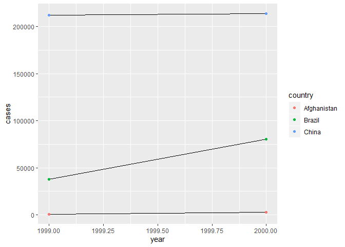

## Chapter 12 Problems

### 12.2.1

 2. Compute the rate for table2, and table4a + table4b. You will need to perform four operations: 
 
    + Extract the number of TB cases per country per year.  
    + Extract the matching population per country per year.  
    + Divide cases by population, and multiply by 10000.  
    + Store back in the appropriate place.  

```r
#table2
data(table2)
table2_cases <- table2 %>%
  spread(type, count) %>%
  mutate(rate = cases / population * 10000)
print(table2_cases)
```

```
## # A tibble: 6 x 5
##   country      year  cases population  rate
##   <chr>       <int>  <int>      <int> <dbl>
## 1 Afghanistan  1999    745   19987071 0.373
## 2 Afghanistan  2000   2666   20595360 1.29 
## 3 Brazil       1999  37737  172006362 2.19 
## 4 Brazil       2000  80488  174504898 4.61 
## 5 China        1999 212258 1272915272 1.67 
## 6 China        2000 213766 1280428583 1.67
```

```r
#table4a + 4b = 4c

table4 <- inner_join(table4a, table4b, by = "country") %>%
  gather(year, cases, c(`1999.x`, `2000.x`)) %>%
  gather(year, population, c(`1999.y`, `2000.y`)) %>%
  mutate(rate = cases / population * 10000) %>%
#  gsub(".y","", table4$year) %>%      Why does including this line get rid of all other information?
  print()
```

```
## # A tibble: 12 x 5
##    country      cases year   population  rate
##    <chr>        <int> <chr>       <int> <dbl>
##  1 Afghanistan    745 1999.y   19987071 0.373
##  2 Brazil       37737 1999.y  172006362 2.19 
##  3 China       212258 1999.y 1272915272 1.67 
##  4 Afghanistan   2666 1999.y   19987071 1.33 
##  5 Brazil       80488 1999.y  172006362 4.68 
##  6 China       213766 1999.y 1272915272 1.68 
##  7 Afghanistan    745 2000.y   20595360 0.362
##  8 Brazil       37737 2000.y  174504898 2.16 
##  9 China       212258 2000.y 1280428583 1.66 
## 10 Afghanistan   2666 2000.y   20595360 1.29 
## 11 Brazil       80488 2000.y  174504898 4.61 
## 12 China       213766 2000.y 1280428583 1.67
```

```r
#gsub(".y","", table4$year)
```

Which representation is easiest to work with? Which is hardest? Why?  
*Both of them sucked. How are you supposed to do these without knowing gather() and spread()?*
*I suppose Table 4 was harder, since I had to join them before I could do anything else, and then separate . Then again, if I didn't have spread, I would have hated 2 a lot, as well.*

 3. Recreate the plot showing change in cases over time using table2 instead of table1. What do you need to do first?

```r
#> # A tibble: 12 x 4
#>   country      year type           count
#>   <chr>       <int> <chr>          <int>
#> 1 Afghanistan  1999 cases            745
#> 2 Afghanistan  1999 population  19987071
#> 3 Afghanistan  2000 cases           2666
#> 4 Afghanistan  2000 population  20595360
#> 5 Brazil       1999 cases          37737
#> 6 Brazil       1999 population 172006362
#> # … with 6 more rows

#option 1: without using tidied data frame
table2.3 <- table2 %>%
  filter(type == "cases") #need to filter out population first

ggplot(table2.3, aes(year, count)) +
  geom_line(aes(group = country)) +
  geom_point(aes(color  = country))
```

<!-- -->

```r
#option 2: using tidied data frame
table2_cases %>% ggplot(aes(year, cases)) +
  geom_line(aes(group = country)) +
  geom_point(aes(color  = country))
```

<!-- -->

### 12.3.3

 1. Why are pivot_longer() and pivot_wider() not perfectly symmetrical? Carefully consider the following example:

```r
stocks <- tibble(
  year   = c(2015, 2015, 2016, 2016),
  half  = c(   1,    2,     1,    2),
  return = c(1.88, 0.59, 0.92, 0.17)
)
print(stocks)
```

```
## # A tibble: 4 x 3
##    year  half return
##   <dbl> <dbl>  <dbl>
## 1  2015     1   1.88
## 2  2015     2   0.59
## 3  2016     1   0.92
## 4  2016     2   0.17
```

```r
stocks %>% 
  pivot_wider(names_from = year, values_from = return) %>% 
  pivot_longer(`2015`:`2016`, names_to = "year", values_to = "return")
```

```
## # A tibble: 4 x 3
##    half year  return
##   <dbl> <chr>  <dbl>
## 1     1 2015    1.88
## 2     1 2016    0.92
## 3     2 2015    0.59
## 4     2 2016    0.17
```
*Oh, that's interesting! In the original tibble (stocks), the `year` column is of class **double**, whereas once the OG tibble has been passed through wider -> longer, `year` is now of class **character**.*
*If one wanted to return `year` to the prior state, you would have to perform the extra step of parsing it.*  
pivot_longer() has a names_ptype argument, e.g. names_ptype = list(year = double()). What does it do?

```r
stocks %>% 
  pivot_wider(names_from = year, values_from = return) %>% 
  pivot_longer(`2015`:`2016`, names_to = "year", values_to = "return", names_ptypes = list(year = double()))
```

```
## # A tibble: 4 x 3
##    half  year return
##   <dbl> <dbl>  <dbl>
## 1     1  2015   1.88
## 2     1  2016   0.92
## 3     2  2015   0.59
## 4     2  2016   0.17
```
*It apparently eliminates the need to parse after performing a round of ~~spreading~~ pivoting wider and ~~gathering~~ pivoting longer.*

 2. Why does this code fail?  

```r
#table4a %>% 
#  pivot_longer(c(1999, 2000), names_to = "year", values_to = "cases")
```
*You forgot the tickmarks for non-syntactic column names, ya dingus!*

```r
table4a %>% 
  pivot_longer(c(`1999`, `2000`), names_to = "year", values_to = "cases")
```

```
## # A tibble: 6 x 3
##   country     year   cases
##   <chr>       <chr>  <int>
## 1 Afghanistan 1999     745
## 2 Afghanistan 2000    2666
## 3 Brazil      1999   37737
## 4 Brazil      2000   80488
## 5 China       1999  212258
## 6 China       2000  213766
```

 3. What would happen if you widen this table? Why? How could you add a new column to uniquely identify each value? *(absolute nightmare question)*

```r
people <- as_tibble(tribble(
  ~name,             ~names,  ~values,
  #-----------------|--------|------
  "Phillip Woods",   "age",       45, #age 1
  "Phillip Woods",   "height",   186,
  "Phillip Woods",   "age",       50, #age 2
  "Jessica Cordero", "age",       37,
  "Jessica Cordero", "height",   156
))

f_it <- as.data.frame(people)
f_it[3,2] = "age2"
print(f_it)
```

```
##              name  names values
## 1   Phillip Woods    age     45
## 2   Phillip Woods height    186
## 3   Phillip Woods   age2     50
## 4 Jessica Cordero    age     37
## 5 Jessica Cordero height    156
```

```r
f_it <- as_tibble(f_it) %>%
  spread(names,name) %>%
  print()
```

```
## # A tibble: 5 x 4
##   values age             age2          height         
##    <dbl> <chr>           <chr>         <chr>          
## 1     37 Jessica Cordero <NA>          <NA>           
## 2     45 Phillip Woods   <NA>          <NA>           
## 3     50 <NA>            Phillip Woods <NA>           
## 4    156 <NA>            <NA>          Jessica Cordero
## 5    186 <NA>            <NA>          Phillip Woods
```

```r
#people %>%
#  group_by(names) %>%
#  mutate(group_id <- group_indices(values)) %>%
#  print()
```

 4. Tidy the simple tibble below. Do you need to make it wider or longer? What are the variables?

```r
preg <- tribble(
  ~pregnant, ~male, ~female,
  "yes",     NA,    10,
  "no",      20,    12
)

preggo <- as_tibble(preg) %>%
  pivot_longer(c("male","female"), names_to = "gender", values_to = "count") %>%
  select(gender, pregnant, count) %>%
  print()
```

```
## # A tibble: 4 x 3
##   gender pregnant count
##   <chr>  <chr>    <dbl>
## 1 male   yes         NA
## 2 female yes         10
## 3 male   no          20
## 4 female no          12
```
 

### 12.4.3

 1. What do the extra and fill arguments do in separate()? Experiment with the various options for the following two toy datasets.

```r
#extra options : warn(default), drop, merge(length(into))
##fill options : warn(emit warning and fill from right), right(fill with missing values on right), left(fill with missing vlues on left)

tibble(x = c("a,b,c", "d,e,f,g", "h,i,j")) %>% #one row has an extra data point
  separate(x, c("one", "two", "three"))
```

```
## Warning: Expected 3 pieces. Additional pieces discarded in 1 rows [2].
```

```
## # A tibble: 3 x 3
##   one   two   three
##   <chr> <chr> <chr>
## 1 a     b     c    
## 2 d     e     f    
## 3 h     i     j
```

```r
#becomes
tibble(x = c("a,b,c", "d,e,f,g", "h,i,j")) %>% #one row has an extra data point
  separate(x, c("one", "two", "three"), extra = "merge")
```

```
## # A tibble: 3 x 3
##   one   two   three
##   <chr> <chr> <chr>
## 1 a     b     c    
## 2 d     e     f,g  
## 3 h     i     j
```

```r
#fill makes no difference here b/c no empty values
```

```r
tibble(x = c("a,b,c", "d,e", "f,g,i")) %>%  #one row lacks a data point
  separate(x, c("one", "two", "three"))
```

```
## Warning: Expected 3 pieces. Missing pieces filled with `NA` in 1 rows [2].
```

```
## # A tibble: 3 x 3
##   one   two   three
##   <chr> <chr> <chr>
## 1 a     b     c    
## 2 d     e     <NA> 
## 3 f     g     i
```

```r
#becomes
tibble(x = c("a,b,c", "d,e", "f,g,i")) %>%  #one row lacks a data point
  separate(x, c("one", "two", "three"), fill = "left") #NA shifted to right (no effect if fill = "right)
```

```
## # A tibble: 3 x 3
##   one   two   three
##   <chr> <chr> <chr>
## 1 a     b     c    
## 2 <NA>  d     e    
## 3 f     g     i
```

 2. Both unite() and separate() have a remove argument*(defaults to TRUE)*. What does it do? Why would you set it to FALSE?

```r
tibble(x = c("a,b,c", "d,e", "f,g,i")) %>%  #one row lacks a data point
  separate(x, c("one", "two", "three"), remove = FALSE)
```

```
## Warning: Expected 3 pieces. Missing pieces filled with `NA` in 1 rows [2].
```

```
## # A tibble: 3 x 4
##   x     one   two   three
##   <chr> <chr> <chr> <chr>
## 1 a,b,c a     b     c    
## 2 d,e   d     e     <NA> 
## 3 f,g,i f     g     i
```
*`remove` allows one to remove a column describing the contents of each row of the original tibble.*  
*Ordinarily, this is useful to remove unnecessary clutter.*  
*Setting `remove = FALSE` could be helpful for someone to check if they separated their observations correctly.*  

 3. Compare and contrast separate() and extract(). Why are there three variations of separation (by position, by separator, and with groups), but only one unite?  
 *`extract()` appears to separate with an additional option to separate according to a regex pattern, which could allow one to cleave cells with a complex pattern that couldn't be caught with `separate()`.*
 *If one had a sentence as an observation, they could separate it in any number of ways (by each letter, each space, by clauses, by SOV), but one can only unite the sentence correctly one way.*  
### 12.6.1

```r
#relevant dataset
data(who)
whom <- who %>%
  pivot_longer(
    cols = new_sp_m014:newrel_f65, 
    names_to = "key", 
    values_to = "cases", 
    values_drop_na = TRUE
  ) %>% 
  mutate(
    key = stringr::str_replace(key, "newrel", "new_rel")
  ) %>%
  separate(key, c("new", "var", "sexage")) %>% 
  select(-new, -iso2, -iso3) %>% 
  separate(sexage, c("sex", "age"), sep = 1) %>%
  print()
```

```
## # A tibble: 76,046 x 6
##    country      year var   sex   age   cases
##    <chr>       <int> <chr> <chr> <chr> <int>
##  1 Afghanistan  1997 sp    m     014       0
##  2 Afghanistan  1997 sp    m     1524     10
##  3 Afghanistan  1997 sp    m     2534      6
##  4 Afghanistan  1997 sp    m     3544      3
##  5 Afghanistan  1997 sp    m     4554      5
##  6 Afghanistan  1997 sp    m     5564      2
##  7 Afghanistan  1997 sp    m     65        0
##  8 Afghanistan  1997 sp    f     014       5
##  9 Afghanistan  1997 sp    f     1524     38
## 10 Afghanistan  1997 sp    f     2534     36
## # ... with 76,036 more rows
```


 3. I claimed that iso2 and iso3 were redundant with country. Confirm this claim.

```r
#count unique values for each column (status = weak evidence)
  summary(unique(who$country)) #219
```

```
##    Length     Class      Mode 
##       219 character character
```

```r
  summary(unique(who$iso2)) #219
```

```
##    Length     Class      Mode 
##       219 character character
```

```r
  summary(unique(who$iso3)) #219
```

```
##    Length     Class      Mode 
##       219 character character
```

```r
#unique combinations of country with iso2 and iso3
#would expect to find 219 combinations if each country has the same equivalent in iso2 and iso3 (status = slightly better evidence!)

nrow(unique(who[,c("country","iso2","iso3")])) #219
```

```
## [1] 219
```
 
 4. For each country, year, and sex compute the total number of cases of TB. Make an informative visualisation of the data.
 
 country > year > sex

```r
#did not get to in time
# whom %>%
# group_by(country,year,sex) %>%
# count(cases)
```
 

